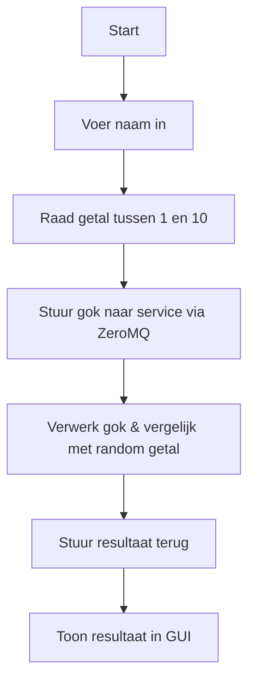
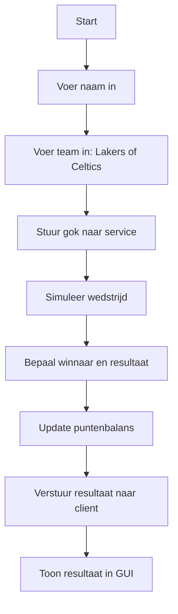

# BasketbalArena Project - Eén gecombineerde service met GUI-client

Welkom bij **BasketbalArena**! Dit project bevat een client in Python met GUI (Tkinter) en een service in C++ die samen twee minigames beheren: BasketbalGame en BasketbalMachine. Communicatie verloopt via ZeroMQ.

---

## Inhoud

- **BasketbalGame** – Raad een getal van 1 t.e.m. 10 en scoor punten.
- **BasketbalMachine** – Gok het winnende team (Lakers of Celtics) en win tot 10 punten.
- **Gezamenlijke puntenbalans** – Beide spellen gebruiken één gedeelde balans per spelersnaam.

---

## Werking

### Spelerflow

1. Speler voert naam in via de GUI-client.
2. Speelt BasketbalGame of BasketbalMachine via knoppen in het venster.
3. Ontvangt feedback en puntenupdate via de GUI.

### BasketbalGame Flow



### BasketbalMachine Flow



---

## Bestandsoverzicht

- `client.py` – Python GUI-client met invoer, ZeroMQ-communicatie en leaderboard popup
- `service.cpp` – C++ service met logica voor BasketbalGame & BasketbalMachine

---

## Communicatie

Alle communicatie gebeurt via **ZeroMQ**:

- PUSH (client -> service): Spelcommando’s zoals gokken of spelen.
- SUB (service -> client): Antwoorden en updates (incl. leaderboard).

Berichtstructuur:
```mermaid
%% Berichten naar services
Emiel --> BasketbalGame : ?Naam>Gok>
Emiel --> BasketbalMachine : ?Naam>Team>

%% Berichten van services
BasketbalGame --> Emiel : !Naam>Resultaat>
BasketbalMachine --> Emiel : !Naam>Resultaat>
Leaderboard --> Emiel : !naam1:score1|naam2:score2|...

```

---

## Uitvoeren

### Service (C++)

Compileer en voer uit:
```bash
g++ -o service service.cpp -lzmq
./service
```

### Client (Python)

Installeer dependencies (indien nodig):
```bash
pip install pyzmq
```

Start GUI-client:
```bash
python client.py
```

---

## Leaderboard

De puntenbalans van elke speler wordt live bijgehouden en weergegeven in een apart leaderboard popupvenster. Punten zijn **niet persistent** – de map wordt gewist bij herstarten van de service.

---
