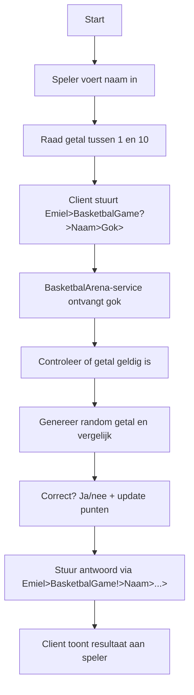
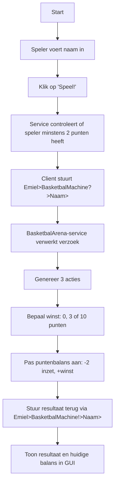
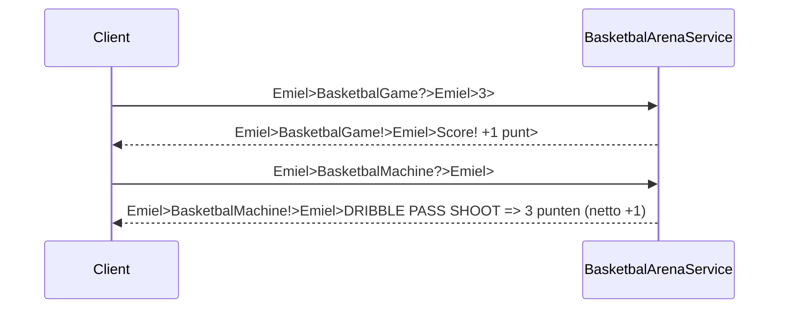

# BasketbalArena Project - Eén gecombineerde service met GUI-client

Welkom bij **BasketbalArena**! Dit project bestaat uit één gecombineerde service met twee ZeroMQ-gebaseerde minigames en een leaderboard:

- **BasketbalGame** – Raad een getal tussen 1 en 10 en verdien punten (mits correcte gok).
- **BasketbalMachine** – Betaal 2 punten per draai, win tot 10 punten op basis van actiescombinatie.

Beide spellen delen een **gezamenlijke puntenbalans per spelernaam**, waardoor er één consistente spelervaring is.

---

## Overzicht

Spelers communiceren via ZeroMQ (PUSH/SUB) met de BasketbalArena-service die op Benternet draait. De speler:

1. Voert zijn naam in via de GUI-client.
2. Stuurt een verzoek naar BasketbalGame of BasketbalMachine.
3. Krijgt een gepersonaliseerd antwoord via de SUB-socket met puntenupdate.

Alle punten worden per spelernaam bijgehouden in een `unordered_map<std::string, int>` aan de servicezijde.

---

## BasketbalGame Flow



---

## BasketbalMachine Flow



---

## Naam & Puntenbeheer

De gecombineerde service gebruikt:

- Eén `unordered_map<std::string, int>` om de punten per speler bij te houden.
- Punten zijn persistent zolang de service draait.
- Spelers moeten dus **dezelfde naam hergebruiken** voor continuïteit.

---

## Communicatieschema



---

## Bestandsoverzicht

- `service.cpp` – C++ gecombineerde BasketbalGame + BasketbalMachine service
- `client.py` – Python GUI-client voor beide spellen
- Optioneel: testscript, documentatie, oudere versies

---

## Uitvoeren

```bash
# BasketbalArena service starten (na compilatie)
service.exe

# GUI-client starten
python client.py
```

---
